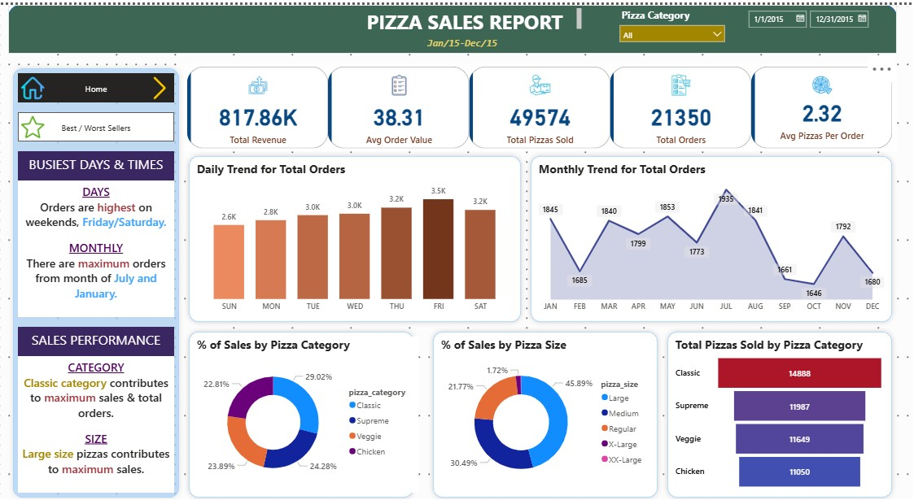

# Pizza Sales SQL Analysis (MySQL & Power BI)

This project includes SQL queries and a Power BI dashboard to analyze pizza sales data

**Data Source:**  
YouTube Channel – [Data Tutorial](https://youtu.be/V-s8c6jMRN0?si=YqvhnHFWELyJ0YcF)

## Key Performance Indicators (KPIs)

1. **Total Revenue**
2. **Average Order Value**
3. **Total Pizza Sold**
4. **Total Orders**
5. **Average Pizzas per Order**

## Trend Analysis

- **Daily Trend for Total Orders**
- **Monthly Trend for Total Orders**

## Sales Distribution

- **Percentage of Sales by Pizza Category**
- **Percentage of Sales by Pizza Size**
- **Total Pizzas Sold by Pizza Category**

## Best & Worst Performers

- **Top 5 Pizzas by Revenue**
- **Bottom 5 Pizzas by Revenue**
- **Top 5 Pizzas by Quantity**
- **Bottom 5 Pizzas by Quantity**
- **Top 5 Pizzas by Total Orders**
- **Bottom 5 Pizzas by Total Orders**

## Power BI Dashboard
  The dashboard visualize KPIs, trends, and performance metrics of pizza sales using interactive visuals in Power BI.

## Preview
Below is a preview of the dashboard created using Power BI:

> More visualizations available in the `Dashboard.pbix` file.

## Contact Me
- 📎 [LinkedIn](https://www.linkedin.com/in/athaya-rahma-puteri)
- 📧 Email: athaya.rahma00@gmail.com
