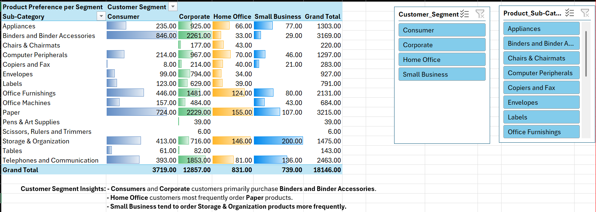

# Sales Data Analysis

## Created by
Athaya Rahma Puteri

## Objective
Analyze sales data by product, region, shipping, and customer segment using Excel.

## Tools Used
- **Excel**:
  - Pivot Table
  - Filtering
  - Charting
  - Conditional Formatting

## Key Findings
- The **Paper** sub-category has the highest number of orders, while **Telephones** generate the highest profit among all sub-categories.
- **Reguler Air** is the most commonly used shipping mode across all transactions.
- The **West Region** recorded the highest total number of orders, whereas the **Northwest Region** contributed the most in terms of overall profit.
- **Consumers** and **Company** purchase **Binders** and **Binder Accessories** the most, while the **Home Office** segment shows a strong preference for **Paper**, and **Small Business** tend to order **Storage & Organization** products more frequently.

## Preview
Below is a preview of the dashboard created using Excel:

> More visualizations available in the `Sales Analysis` folder.

## Data Source
The data used for this analysis was sourced from the publicly available **SALES STORE PRODUCT DETAILS** from Kaggle, which is commonly used for data analysis practice. It includes sales information from a fictional store, encompassing product categories, customer segments, and regional sales data.

## LinkedIn
[LinkedIn Profile](http://www.linkedin.com/in/athaya-rahma-puteri)

## Email
athaya.rahma00@gmail.com
